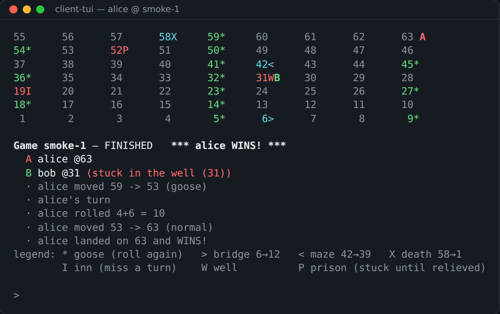

# kafka-goose-game

[](https://github.com/maxtrezzi/kafka-goose-game/actions/workflows/ci.yml)


[](LICENSE)

A multiplayer **Game of the Goose** (Gioco dell'Oca) built on plain **Java 21**
and **Apache Kafka**, with no frameworks. It is a test bed for what is current
in both: **Kafka 4.x** without ZooKeeper, driven through the raw client APIs
rather than a framework, and **Java 21** used for what it now offers —
records, sealed interfaces, exhaustive pattern matching, virtual threads. The
point is to see how those features behave when they carry a complete system,
not a snippet: a real cluster, a real failure mode, a game you can sit down and
play.

Everything is **[event-sourced](docs/11-glossary.md#event-sourcing) and
[server-authoritative](docs/11-glossary.md#server-authoritative)**. Clients only
send *requests*, and a single server turns them into *facts*. Every piece of
state, on the server and in each client alike, is a
[fold](docs/11-glossary.md#fold) over the log of those facts: the events applied
one by one, in order. Kill any process and restart it, and it rebuilds itself by
reading the topic again.



*The terminal client at the end of a real game against a Kafka broker: alice has
landed on 63, bob is still stuck in the well.*

## Highlights

- **The log is the only state.** The server and every client rebuild what they
  know by replaying `game.events`. Kill any process, start it again, and it
  comes back to exactly where it was — no database, no snapshot.
- **At-least-once, in the right order.** The server confirms that its events
  are written (`acks=all`, idempotent producer) *before* it commits the
  command's offset. The one case where a repeated command still has an effect
  is named in the [documentation](docs/01-architecture.md#delivery-guarantees-at-least-once-with-the-limits-stated),
  not left for someone to find.
- **Java 21 as the structure of the code.** `Command` and `Event` are sealed
  interfaces of records, and every fold is an exhaustive `switch`: a new event
  type does not compile until every fold handles it. Each consumer loop runs
  on its own virtual thread.
- **Pure rules, tested without Kafka.** `GameEngine.decide(state, command, dice)`
  returns events and has no side effects; dice and clock are injected. The same
  seam drives a fully deterministic end-to-end game against a real broker in
  Testcontainers.
- **Found by playing, not by unit tests.** The first live game froze with both
  players trapped (well + prison), which led to a rule change
  ([ISSUES.md #7](ISSUES.md#7-the-documented-wellprison-deadlock-happened-in-the-first-live-game-step-7));
  a broker-failure test turned out to test nothing and was redesigned
  ([#8](ISSUES.md#8-the-broker-kill-test-raced-the-game-and-lost-step-8)).
- **Fault tolerance shown, not claimed.** Three KRaft brokers, three copies of
  every partition, `min.insync.replicas=2`: a whole game played with one broker
  down. CI runs the unit tests, the integration tests, the Docker demo and a
  check of the documentation on every push.

## Architecture

```
 ┌────────────┐  Command (JoinGame,           ┌────────────────┐
 │ client-tui │  StartGame, RollDice)         │  GooseServer   │
 │  (alice)   │──────────────┐                │                │
 └────────────┘              ▼                │ 1. replay      │
 ┌────────────┐   ╔══════════════════╗        │    game.events │
 │ client-tui │──▶║  game.commands   ║───────▶│    → state     │
 │   (bob)    │   ║ 3 part. / RF=3   ║        │ 2. per command:│
 └────────────┘   ╚══════════════════╝        │    GameEngine  │
       ▲                                      │    .decide()   │
       │          ╔══════════════════╗        │    → events    │
       └──────────║   game.events    ║◀───────│    (SecureRandom
    Event (PlayerJoined, GameStarted,║        │     dice)      │
    DiceRolled, PlayerMoved, ...)    ║        └────────────────┘
                  ║ 3 part. / RF=3   ║
                  ╚══════════════════╝
         both topics keyed by gameId, min.insync.replicas=2
```

| Module        | Depends on   | What it is |
|---------------|--------------|------------|
| `protocol`    | —            | The [wire contract](docs/11-glossary.md#wire-contract): sealed `Command` and `Event` records, the JSON `JsonSerde` with a fixed list of message types and a 10 KiB limit, and the topic names |
| `engine`      | protocol     | The game rules as pure functions, with no Kafka imports: `GameEngine.decide(state, command, dice) -> List<Event>` and `GameState.apply(event)` |
| `server`      | engine       | The only process that decides: it replays `game.events`, then for each command runs `decide`, writes the resulting events, and folds them into its own state (at-least-once, `acks=all`, idempotent producer) |
| `client-core` | protocol     | A client library that knows nothing about any UI: it sends commands, follows events on a virtual thread, and folds them into a `GameView` any UI can draw |
| `client-tui`  | client-core  | The terminal UI in ANSI colour: the 63-square board drawn as a snaking grid, plus a command loop reading from standard input |

The board has 63 squares:

- a goose (`*`) repeats your move;
- the bridge sends you from 6 to 12, the maze back from 42 to 39, and death at
  58 back to 1;
- the inn at 19 costs you one turn;
- the well at 31 and the prison at 52 hold you until another player lands
  there — except that the **last free player is never trapped**, so a game can
  never freeze;
- you win by landing exactly on 63, and going past it bounces you back.

## Quickstart

Prerequisite: Docker with the compose plugin.

```bash
# 1. The 3-broker KRaft cluster, the topics, and the server (built from source)
docker compose --profile game up -d --build

# 2. Two players, in two terminals
docker compose run --rm tui game-1 alice
docker compose run --rm tui game-1 bob
```

Then, in the clients: both type `join`, one types `start`, and take turns
typing `roll` until someone lands on 63. `quit` and relaunch a client mid-game:
it repaints the exact board state by replaying `game.events` from the beginning.
`docker compose --profile game down` stops everything and throws the cluster
away.

### Without Docker for the application

To work on the code, run the cluster in Docker and the server and clients from
Maven. This needs Java 21 and Maven as well.

```bash
# 1. Start the cluster only (creates the topics, then init-topics exits)
docker compose up -d

# 2. Build everything once (installs the sibling modules for exec:java)
mvn -q -DskipTests install

# 3. Start the server (terminal 1)
mvn -pl server exec:java -Dexec.mainClass=com.goosegame.server.GooseServer

# 4. Start two players (terminals 2 and 3)
mvn -pl client-tui exec:java -Dexec.args="localhost:9092 game-1 alice"
mvn -pl client-tui exec:java -Dexec.args="localhost:9092 game-1 bob"
```

Do not mix the two ways: the containerized server and a server started from
Maven would share the consumer group and split the games between them, which
the single-server design does not support.

### TUI commands

| Command       | Effect |
|---------------|--------|
| `join [name]` | join the game (defaults to your player name; also switches your identity) |
| `start`       | start the game (2–6 players, from the lobby) |
| `roll`        | roll the dice on your turn (out of turn, the client warns you and the server ignores the roll) |
| `board`       | reprint the board |
| `help`        | command list |
| `quit`        | leave — the game goes on; rejoin to catch up by replay |

Client args: `[bootstrap [gameId [player]]]`, defaulting to
`localhost:9092 game-1 <os-user>`. Run several games at once by picking
different `gameId`s. In Docker the bootstrap address is fixed, and the
arguments are `[gameId [player]]`.

## Build & test

```bash
mvn test        # unit tests only — no Docker needed
mvn verify      # + the integration tests (each starts a throwaway Kafka container)
```

Building one module on its own needs an extra flag: `mvn -pl engine -am test`.
Without `-am`, Maven looks for the other modules in the local repository, where
a fresh clone has never installed them.

What each module's tests cover:

- `protocol` — writes and reads back every message type, and rejects payloads
  that are malformed, too large, or of an unknown type.
- `engine` — every rule on the board, plus complete games played with a fixed
  list of dice rolls.
- `server` — one end-to-end test that gives the same result every time, using
  scripted dice against a real Kafka running in a container. It also checks,
  after every event, that the client's fold and the server's fold agree.
- `client-core` — the fold that turns events into the view, and `GameClient`
  against a real broker: replay, the filter by game, unreadable records, and
  the commands it sends.
- `client-tui` — the renderer, checked on its output with the colour codes
  removed, and the hint the client shows before a command the server will
  probably reject.

## Kafka experiments

Five things to try against the running cluster, each with the exact commands,
in [docs/kafka-experiments.md](docs/kafka-experiments.md):

1. [Stop a broker in the middle of a game](docs/kafka-experiments.md#1-stop-a-broker-in-the-middle-of-a-game)
   and watch the in-sync replicas shrink and recover.
2. [Watch the event log live](docs/kafka-experiments.md#2-watch-the-event-log-live)
   with the console consumer.
3. [Inspect consumer groups and offsets](docs/kafka-experiments.md#3-inspect-consumer-groups-and-offsets).
4. [Replay a finished game](docs/kafka-experiments.md#4-replay-a-finished-game)
   by restarting the server or a client.
5. [What is not done here: SASL/SCRAM and ACLs](docs/kafka-experiments.md#5-not-done-here-saslscram-and-acls),
   and how it would be added.

## Documentation

The full description of how the project is built, and why, lives in
[`docs/`](docs/00-overview.md): the architecture, one chapter per layer, the
infrastructure, the testing strategy, and a complete list of the patterns used
and the anti-patterns avoided, each with the reasoning behind it.

Terms that are standard in Kafka, Java or software design but not obvious on
first reading are explained in the [glossary](docs/11-glossary.md), each in a
few lines and with a link to a source. The same chapters are also available as
one [PDF](docs/kafka-goose-game-implementation.pdf), which can be rebuilt with
`./docs/build-pdf.sh` (it needs pandoc and WeasyPrint).

Project logs:

- [Implementation plan](docs/10-implementation-plan.md) — the 8-step plan this
  project was built from
- [DECISIONS.md](DECISIONS.md) — every non-obvious design call, with reasoning
- [ISSUES.md](ISSUES.md) — every problem hit along the way and its actual fix

## How this was built

The project was built with an AI coding assistant (Claude Code) working as a
pair. The architecture, the fixed constraints and the 8-step plan were written
first ([chapter 10](docs/10-implementation-plan.md)). Each step was then
implemented with the assistant and reviewed, and the author approved it before
it was committed. Changes to the game itself, such as the new rule after the
first live game froze ([ISSUES.md #7](ISSUES.md#7-the-documented-wellprison-deadlock-happened-in-the-first-live-game-step-7)),
were the author's decision. The commits the assistant co-wrote carry a
`Co-Authored-By` line.

## Future ideas

- A web UI, using Javalin with server-sent events, built on `client-core`.
- A move from JSON to Avro with a Schema Registry.
- Running several server instances at once. Keying by `gameId` already allows
  it; DECISIONS.md explains why there is only one today.

## License

[MIT](LICENSE) — © 2026 maxtrezzi.
